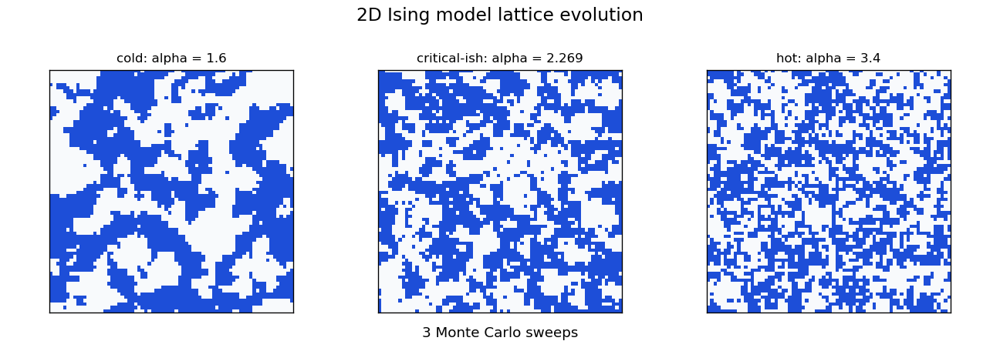
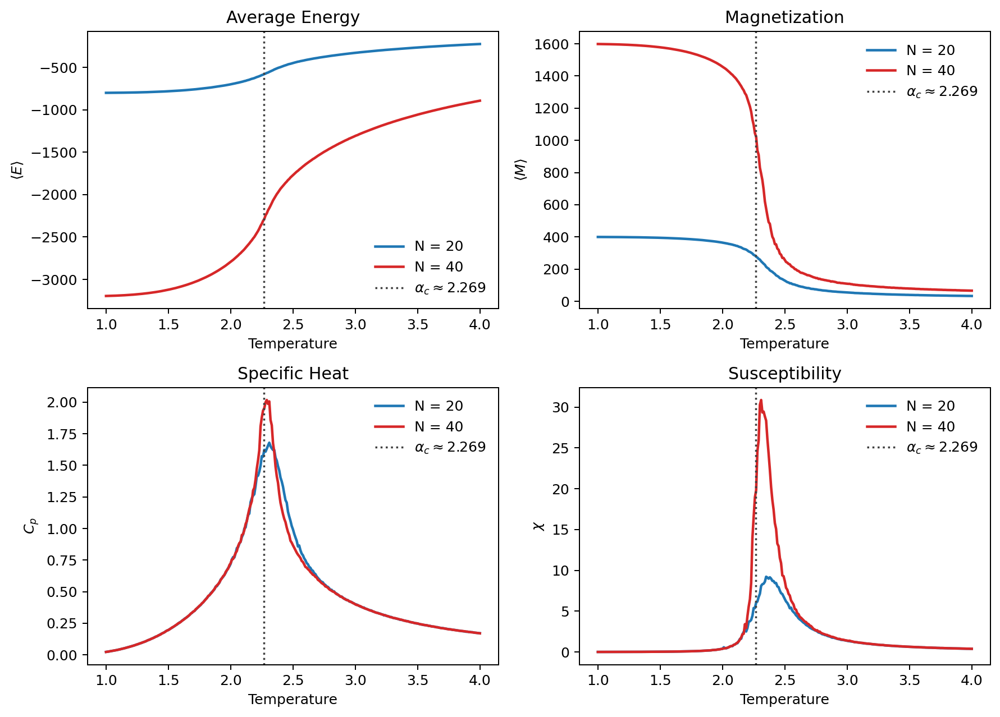

# 2D Ising Model

I made this from a graduate-level statistical thermodynamics course: **CH50013**. It is a Monte Carlo simulation of the **2D Ising model**.

## Lattice In Motion

Here is the lattice evolving over time at three temperatures:

At low temperature, neighboring spins prefer to line up, so large ordered regions appear. At high temperature, thermal motion keeps breaking the order. Near the critical temperature, the lattice becomes the most interesting: clusters form at many length scales, and the system sits right between ordered and disordered behavior.

## Ising Model Background

The 2D Ising model puts one spin on every point of a square lattice:

$$
s_i \in \{-1,+1\}
$$

For the ferromagnetic model, neighboring spins prefer to point in the same direction. The Hamiltonian is:

$$
\mathcal{H}(\mathbf{s})
=
-J\sum_{\langle i,j\rangle}s_i s_j
-h\sum_i s_i
$$

In this project, the external field is zero, so $h=0$. The nearest-neighbor term is the whole game: aligned spins give $s_i s_j=+1$, which lowers the energy; opposite spins give $s_i s_j=-1$, which raises it.

The intimidating part is that the full equilibrium behavior lives inside the partition function:

$$
Z_N(\beta)
=
\sum_{\{s_i=\pm1\}}
\exp[-\beta\mathcal{H}(\mathbf{s})],
\qquad
\beta=\frac{1}{k_BT}
$$

For an $N\times N$ lattice, that sum has:

$$
2^{N^2}
$$

possible spin configurations. Monte Carlo is the escape hatch: instead of enumerating every state, it samples the states that actually matter thermodynamically.

The simulation uses the dimensionless temperature:

$$
\alpha=\frac{k_BT}{J},
\qquad
K=\beta J=\frac{J}{k_BT}=\frac{1}{\alpha}
$$

The code sets $J=1$, so $\alpha$ is the temperature scale.

## Metropolis Update

The simulation flips one randomly chosen spin at a time. Only the four nearest neighbors matter for the energy change:

$$
\Delta E
=
2Js_{i,j}
\left(
s_{i+1,j}+s_{i-1,j}+s_{i,j+1}+s_{i,j-1}
\right)
$$

The Metropolis rule is compact:

$$
P_{\mathrm{accept}}
=
\min\left(1,e^{-\beta\Delta E}\right)
$$

With $J=1$, this becomes:

$$
P_{\mathrm{accept}}
=
\min\left(1,e^{-\Delta E/\alpha}\right)
$$

This is what lets the lattice sometimes make an energetically bad move. That randomness is important because real thermal systems fluctuate, especially near the critical point.

## Onsager's Critical Temperature

The 2D Ising model is famous because Lars Onsager solved the square-lattice model exactly in 1944. One of the biggest results is the exact critical temperature for the infinite lattice.

For the square lattice, the critical point satisfies:

$$
\sinh(2K_c)=1
$$

Then:

$$
2K_c=\sinh^{-1}(1)
=
\ln(1+\sqrt{2})
$$

$$
K_c
=
\frac{1}{2}\ln(1+\sqrt{2})
$$

Since $\alpha=1/K$, the critical dimensionless temperature is:

$$
\alpha_c
=
\frac{2}{\ln(1+\sqrt{2})}
\approx
2.269
$$

That number is the vertical reference line in the plots. My finite lattices do not produce a perfectly sharp singularity because `N = 20` and `N = 40` are still small compared with the infinite model. Instead, the transition shows up as rounded peaks in specific heat and susceptibility near Onsager's value.

The spontaneous magnetization also has a famous exact form, later derived by Yang:

$$
m(K)
=
\left[1-\sinh^{-4}(2K)\right]^{1/8},
\qquad
K>K_c
$$

$$
m(K)=0,
\qquad
K\le K_c
$$

That is why the magnetization curve drops so sharply near the critical region.

## The Bigger Run

The main C++ simulation runs the Metropolis algorithm for two lattice sizes:

- `N = 20`
- `N = 40`

It scans temperatures from `alpha = 1.00` to `alpha = 4.00` and records energy, magnetization, specific heat, susceptibility, and acceptance ratio.

